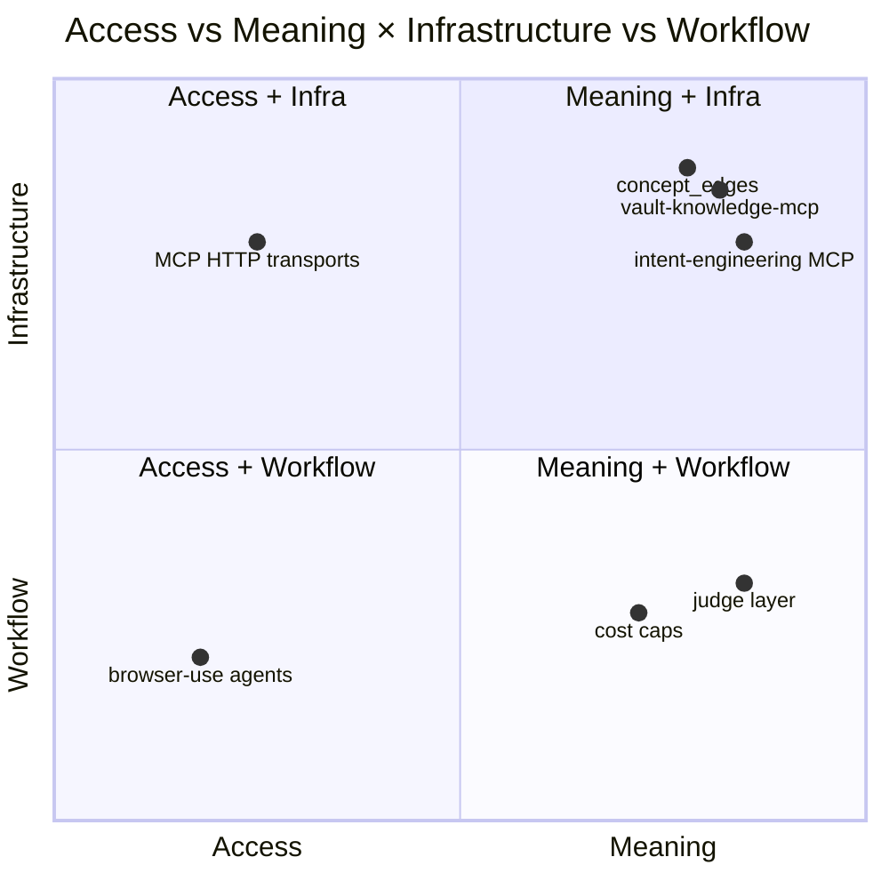

# `/essays/` Route v1 — Build Spec

> **Status:** Drafted 2026-05-17. Awaiting Sean's lock.
> **Scope:** The `/essays/` route — index, per-essay deep-dive pages, RSS feed. Inherits everything from the four prior locked specs (hero, projects, case-study, about, transactions, architecture).
> **First occupant:** Access-vs-Meaning Manifesto (Task 13, draft-lock 2026-05-22, publish ~2026-06-19). **The URL in Sean's email signature.** Permanent IA for future thesis-shaped writing.
> **Buildable as-is** once locked. Hand to a Claude Code session with this file + the inherited specs open.

---

## 1. The Essays Route, in one sentence

A sober-middle / personal-voice-bookended editorial surface for **thesis-shaped writing** — where the manifesto's quadrantChart and role-map table sit alongside cross-linked artifact references, the canonical Markdown lives upstream in `code-brain/docs/`, and recruiters who arrive cold from Sean's email signature read the thesis + click straight to the artifacts that back it.

## 1.1 Changelog

- **2026-05-17:** Initial draft. Establishes /essays/ as the **fourth top-level IA surface** (alongside /work/, /transactions/, /architecture/), specifically for **thesis-shaped writing that frames multiple artifacts into a single argument** — distinct from /architecture/, which argues *about a single system*. An artifact can appear on all four surfaces simultaneously with the same slug, bidirectionally cross-linked. Closes the four-surface cross-link graph: every artifact named in an essay's `plottedArtifacts` array auto-renders "← named in: [essay title]" on its ledger row + architecture writeup, build-derived by `derive_crosslinks.mjs`. No schema changes required on locked transactions or architecture specs (this is the third surface to receive reverse links via the same script).

---

## 2. Anatomy

### 2.1 Index page (`/essays/`)

```
                    ╲╱╲╱╲╱╲╱╲ torn-paper edge (top) ╲╱╲╱╲╱╲╱╲
┌──────────────────────────────────────────────────────────────────────┐
│                                                                      │
│  BOSTON, JUNE 19, 2026 — manifesto published. 1 essay.               │
│  ──────────────────────────────────────────────────────────────      │
│                                                                      │
│  Essays                                                              │
│                                                                      │
│  I bet on meaning, not access.                                       │
│                                                                      │
│  Thesis-shaped writing where the artifacts back the claim.           │
│                                                                      │
│  1 ESSAY · LAST PUBLISHED 2026-06-19 · RSS →                         │
│                                                                      │
│  ────────────────────────────────────────────────────────────────    │
│  JUN 19, 2026   PUBLISHED   Access vs Meaning                        │
│                              I bet the durable enterprise value is   │
│                              the semantic layer, not browser-clicking│
│                              agents. Here are the seven artifacts.   │
│                              ┌─ quadrant thumb ─┐                    │
│                              │  ▮▮ ▮▯           │                    │
│                              │  ▯▮ ▮▯           │                    │
│                              └──────────────────┘                    │
│  ────────────────────────────────────────────────────────────────    │
│                                                                      │
│                                                                      │
│  ─── footer fold ─────────────────────────────────────────────       │
│  → subscribe via RSS    → read on Substack    → view the fleet ↗     │
│                                                                      │
└──────────────────────────────────────────────────────────────────────┘
                    ╲╱╲╱╲╱╲╱╲ torn-paper edge (bottom) ╲╱╲╱╲╱╲╱╲
```

Five bands. **Dateline → page title block (h1 + 1-line italic hook + sober subhead + metadata strip) → essay rows → footer fold.** Paper edge to edge. The 1-line hook is the page's only Newsreader-italic moment above the rows.

### 2.2 Deep-dive page (`/essays/<slug>/`)

```
                    ╲╱╲╱╲╱╲╱╲ torn-paper edge (top) ╲╱╲╱╲╱╲╱╲
┌──────────────────────────────────────────────────────────────────────┐
│                                                                      │
│  BOSTON, JUNE 19, 2026 — access vs meaning, published.               │
│                                                  6 MIN READ          │
│  ──────────────────────────────────────────────────────────────      │
│                                                                      │
│  ESSAYS · PUBLISHED                                                  │
│  Access vs Meaning                                                   │
│  A bet on the semantic layer.                                        │
│  meaning-layer · agents · pm-thesis                                  │
│                                                                      │
│  PUBLISHED 2026-06-19 · LAST REVISED 2026-07-10                      │
│  (mono strip; "LAST REVISED" only renders when ≠ published)          │
│                                                                      │
│  ─── thesis pullquote ──────────────────────────────────────────    │
│  "I don't think the durable enterprise value is agents clicking      │
│   around UIs. I think it's the semantic layer: typed work objects,   │
│   authorization, memory provenance, reviewable decisions."           │
│                                                                      │
│  ── The bet ───────────────────────────────────────────              │
│  Newsreader 20px weight 300, max-width 680px.                        │
│  Personal-voice opener — Sean-coded, one concrete moment from        │
│  recent work. ~150 words. No visual chrome marks the register.       │
│                                                                      │
│                                                                      │
│  ── Artifact map ─────────────────────────────────                   │
│  Sober/declarative prose, ~400 words. Lead paragraph tees up         │
│  the quadrantChart that follows.                                     │
│                                                                      │
│  ┌─ MERMAID quadrantChart ─────────────────────────────┐             │
│  │           infrastructure ↑                          │             │
│  │           │                                         │             │
│  │   [iemcp] │  [browser-use access ✗]                 │             │
│  │   [vkmcp] │                                         │             │
│  │   [ce]    │  [mcp http transports ✗]                │             │
│  │ ──────────┼──────────────  meaning vs access ──→    │             │
│  │   [judge] │                                         │             │
│  │   [cost]  │  [computer-use access ✗]                │             │
│  │           │                                         │             │
│  │           workflow ↓                                │             │
│  └─────────────────────────────────────────────────────┘             │
│  fig 1 — five artifacts on the meaning side; two negative-space     │
│         callouts on the access side                                  │
│                                                                      │
│  ┌─ QUADRANT LEGEND ─────────────────────────────────────┐           │
│  │ iemcp    → intent-engineering MCP                     │           │
│  │ vkmcp    → vault-knowledge-mcp                        │           │
│  │ ce       → concept_edges (memory primitive)           │           │
│  │ judge    → judge layer (review primitive)             │           │
│  │ cost     → cost caps (authority primitive)            │           │
│  └───────────────────────────────────────────────────────┘           │
│  (wire-service mono table; linked slugs to ledger rows               │
│   and architecture writeups via the cross-link graph)                │
│                                                                      │
│                                                                      │
│  ── Role map ─────────────────────────────────                       │
│  Sober prose, ~400 words. Tees up the role-map table:                │
│                                                                      │
│  ┌──────────────────┬──────────────────┬──────────────────┬────────┐ │
│  │ BUYER            │ POSITION         │ VOCABULARY TELL  │ JD ↗   │ │
│  ├──────────────────┼──────────────────┼──────────────────┼────────┤ │
│  │ Anthropic FDE    │ meaning + workflow│ "control arch…" │ link ↗ │ │
│  │ Glean            │ meaning + infra  │ "knowledge gov…" │ link ↗ │ │
│  │ Sierra/Decagon   │ meaning + workflow│ "agent PM…"     │ link ↗ │ │
│  │ Cursor/Cognition │ mixed            │ "dev workflow…"  │ link ↗ │ │
│  │ Manus/Adept      │ access + workflow│ "computer-use"   │ link ↗ │ │
│  └──────────────────┴──────────────────┴──────────────────┴────────┘ │
│  last validated 2026-06-19                                           │
│                                                                      │
│                                                                      │
│  ── Why not browser-first ──────────────────────────                 │
│  Sober/declarative prose, ~250 words. One concrete failure mode.     │
│                                                                      │
│                                                                      │
│  ── The bet, restated ────────────────────────────                   │
│  Personal-voice close — quotable line, Sean-honest. ~150 words.      │
│  The kicker that gets quoted back in the recruiter call.             │
│                                                                      │
│                                                                      │
│  ─ ARTIFACTS PLOTTED ON THE CHART ──────────────────────────         │
│  → intent-engineering MCP — /transactions/intent-engineering-mcp/    │
│  → vault-knowledge-mcp — /architecture/vault-knowledge-mcp/          │
│  → concept_edges (Phase D) — /transactions/phase-d-typed-edges/      │
│  → judge layer — /transactions/judge-layer/                          │
│  → cost caps as authority — /transactions/control-architecture/      │
│  (wire-service mono list, auto-rendered from frontmatter             │
│   plottedArtifacts via cross-link graph)                             │
│                                                                      │
│                                                                      │
│  ─ EXPLANATION (4Q) ───────────────────────────────────────         │
│  (rendered from canonical EXPLANATION.md, fetched at build)          │
│                                                                      │
│  ## What is this?                                                    │
│  ## Why this approach?                                               │
│  ## What would break?                                                │
│  ## What did I learn?                                                │
│                                                                      │
│  → read on Substack ↗                                                │
│  → read the canonical source on github ⓘ                            │
│  → read the canonical EXPLANATION.md on github ⓘ                    │
│                                                                      │
│  ─ RELATED ────────────────────────────────────────────────         │
│  → ledger row: /transactions/meaning-over-access/                    │
│  → companion architecture writeup: Vault as Agent Infrastructure     │
│                                                                      │
│  ─ NEXT / PREV ──────────────────────────────────────────────       │
│  (none)                                                       (none) │
│                                                                      │
│  ◐ registration mark (page closeout)                                 │
└──────────────────────────────────────────────────────────────────────┘
                    ╲╱╲╱╲╱╲╱╲ torn-paper edge (bottom) ╲╱╲╱╲╱╲╱╲
```

**Twelve bands.** Dateline → title block → published/revised strip → thesis pullquote → essay body (5 sections per the manifesto's outline, with embedded quadrantChart + legend + role-map table inline) → plotted-artifacts section → 4Q block → three foot-of-page links (Substack + canonical source + canonical EXPLANATION) → Related block → next/prev → registration mark.

---

## 3. The schema

`src/content/config.ts` adds an `essays` collection alongside `transactions` + `architecture`:

```ts
const essaysCollection = defineCollection({
  type: 'content',
  schema: z.object({
    // --- Identity ---
    title: z.string(),
    subtitle: z.string().optional(),
    dateline: z.string(),                          // "BOSTON, JUNE 19, 2026"
    published: z.string().regex(/^\d{4}-\d{2}-\d{2}$/),
    lastRevised: z.string().regex(/^\d{4}-\d{2}-\d{2}$/).optional(),
    readingTime: z.number().int().positive(),

    // --- IA + status ---
    status: z.enum(['DRAFT', 'PUBLISHED']),
    tags: z.array(z.string()).min(2).max(6),

    // --- Comprehension layer ---
    excerpt: z.string().max(280),                  // 1-line thesis pullquote (also page meta description)

    // --- Canonical sources (fetched at build) ---
    sourceUrl: z.string().url(),                   // raw GitHub URL of canonical Markdown
    explanationUrl: z.string().url(),              // raw GitHub URL of 4Q EXPLANATION.md

    // --- Visual centerpiece (optional but expected for thesis-shaped essays) ---
    mermaidSource: z.string().optional(),          // path under src/content/essays/diagrams/<slug>.mmd OR inline source

    // --- Structured legend for the chart (parallel to /architecture/ scoreboard) ---
    quadrantLegend: z.array(z.object({
      key: z.string(),                             // short code on the chart, e.g., "iemcp"
      label: z.string(),                           // human-readable, e.g., "intent-engineering MCP"
      artifact: z.string().optional(),             // slug; auto-links to /transactions/<slug>/ + /architecture/<slug>/ when both exist
    })).optional(),

    // --- Role map (structured table, validated at build) ---
    roleMap: z.object({
      lastValidated: z.string().regex(/^\d{4}-\d{2}-\d{2}$/),
      rows: z.array(z.object({
        buyer: z.string(),
        position: z.string(),
        vocabularyTell: z.string(),
        jdUrl: z.string().url(),
      })).min(2).max(8),
    }).optional(),

    // --- Cross-link contracts ---
    plottedArtifacts: z.array(z.string()).optional(),  // slugs; reverse-renders "← named in: this essay" on each
    relatedLedgerRow: z.string().optional(),
    relatedCaseStudy: z.string().optional(),
    relatedArchitecture: z.array(z.string()).optional(),
    relatedEssays: z.array(z.string()).optional(),

    // --- Syndication + footer affordances ---
    crossPostedTo: z.array(z.object({
      name: z.string(),                            // e.g., "Substack"
      url: z.string().url(),
    })).optional(),
    sourceRepoUrl: z.string().url().optional(),

    // --- OG ---
    ogImage: z.string().optional(),                // defaults to /og-cards/essays/<slug>.png at render time
  }),
});
```

### 3.1 What's NOT in the schema (and why)

- **No `surface` field.** Essays don't filter by surface in v1 (small collection, ≤3 in year one).
- **No `methods[]` (per ledger/architecture).** Essays aren't artifact-shaped — they're framing-shaped. The "methods" of an essay are the artifacts it cites, captured via `plottedArtifacts` + `relatedArchitecture` + `relatedLedgerRow`.
- **No `limitations[]` (per ledger).** A thesis-shaped essay's calibration lives in its own prose (the "Why not browser-first" section in the manifesto). Surface chrome shouldn't carry calibration.
- **No `honestNotes[]` (per architecture).** Same reason — the essay's prose handles its own register. Wire-service callouts inside Newsreader essay prose are an architecture-specific pattern.
- **No inline-body fallback for the 4Q.** Essays require canonical `explanationUrl`. No legacy entries to migrate.
- **No `scoreboard` field.** That's an architecture-spec primitive. Essays use `quadrantLegend` + `roleMap`.
- **No `previousVersion`.** Essays don't supersede in this iteration. Major revisions update `lastRevised`; a complete rewrite earns a new slug.

---

## 4. Vertical budget

### 4.1 Index page — desktop

| Slot | Height | Notes |
|---|---|---|
| Torn-paper top | 32px | |
| Top padding | 60px | |
| **Dateline strip** | ~54px | local build-time render, no Daily Driver pattern needed |
| Gap | 40px | |
| **Page title block** | ~240px | h1 "Essays" (Newsreader `clamp(56px, 6vw, 96px)`) + 1-line italic hook + sober subhead + mono metadata strip |
| Gap | 56px | |
| **Essay rows** | ~150px per row + 0.5px divider | 1-3 rows expected in v1 |
| Gap | 80px | |
| **Footer fold** | ~80px | three links: RSS / Substack / fleet |
| Bottom padding | 60px | |
| Torn-paper bottom | 32px | |
| **Page height** | ~700-1100px for 1-3 essays | shortest editorial surface on the site |

### 4.2 Deep-dive page — desktop

| Slot | Height | Notes |
|---|---|---|
| Torn-paper top | 32px | |
| Top padding | 60px | |
| **Dateline + reading-time** | ~54px | |
| **Surface + status pills row** | ~24px + 12px margin | `ESSAYS · PUBLISHED` |
| **Title + subtitle** | ~160px | Newsreader title `clamp(40px, 5vw, 72px)` + Newsreader subtitle `clamp(20px, 2.2vw, 28px)` weight 300 italic |
| **Tags** | ~20px + 24px margin | mono, dot-separated |
| **Published/Revised strip** (conditional) | ~32px + 16px margin | only if `lastRevised` set ≠ `published` |
| Gap | 48px | |
| **Thesis pullquote** | ~140-200px | Newsreader 24px italic, paper bg, 0.5px teal rules |
| Gap | 64px | |
| **Essay body** | variable; ~1,800-2,400px for ~1,500 words | Newsreader 20px weight 300, line-height 1.6, max-width 680px; section headings = Newsreader 32px weight 500 (sober); embedded quadrantChart + legend + role-map table inline |
| Gap | 80px | |
| **Plotted artifacts section** | ~140-220px | conditional on `plottedArtifacts[].length > 0`; wire-service mono list |
| Gap | 80px | |
| **4Q block** | ~600px | shared `<FourQBlock />` |
| Gap | 32px | |
| **Three foot-of-page links** | ~96px | "Read on Substack →" + "Read the canonical source on github →" + "Read the canonical EXPLANATION.md →" |
| Gap | 64px | |
| **Related block** | ~140-200px | conditional |
| Gap | 64px | |
| **Next/Prev nav** | ~80px | only renders when there are siblings; renders "(none)" placeholders otherwise |
| Bottom padding | 80px | registration mark sits bottom-right |
| **Page height** | ~3200-4000px typical | shorter than /architecture/ (2000-word essay vs. 1500-word manifesto + visual centerpiece) |

---

## 5. Type system (deltas only)

Inherits hero §4 + case-study §4 + ledger §5 + architecture §5. Deltas for /essays/:

| Role | Font | Size | Weight | Tracking | Color |
|---|---|---|---|---|---|
| Index page h1 | Newsreader | `clamp(56px, 6vw, 96px)` | 400 | -0.6px | `#0A3E42` |
| **Index page 1-line italic hook** | Newsreader | `clamp(20px, 2.4vw, 32px)` | 300 italic | -0.2px | `#1A1A1E` |
| Index page sober subhead | Newsreader | 18 / 16 | 300 | -0.1px | `#546E71` |
| Index page metadata strip | JetBrains Mono | 12 | 500 | 1.6px | `#546E71` |
| **Essay row title** | Newsreader | 22 / 20 | 400 | -0.2px | `#1A1A1E` |
| Essay row excerpt | Newsreader | 16 / 15 | 300 | -0.1px | `#546E71` |
| **Deep-dive title** | Newsreader | `clamp(40px, 5vw, 72px)` | 400 | -0.4px | `#0A3E42` |
| **Deep-dive subtitle** | Newsreader | `clamp(20px, 2.2vw, 28px)` | 300 italic | -0.2px | `#546E71` |
| **Published/Revised strip** | JetBrains Mono | 11 | 500 | 1.6px | `#7C2D12` (PUBLISHED prefix) + `#546E71` (LAST REVISED prefix + dates) |
| **Thesis pullquote** | Newsreader | `clamp(22px, 2.8vw, 32px)` | 300 italic | -0.3px | `#0A3E42` |
| **Essay body prose** | Newsreader | 20 / 18 | 300 | -0.1px line-height 1.6 | `#1A1A1E` |
| **Essay section heading** | Newsreader | `clamp(28px, 3.2vw, 40px)` | 500 | -0.4px | `#0A3E42` |
| Block quote prose | Newsreader | 20 / 18 | 300 italic | -0.1px line-height 1.6 | `#546E71` |
| Block quote attribution | JetBrains Mono | 12 | 500 | 1.2px | `#7C2D12` |
| Code block | JetBrains Mono | 13 | 400 | 0.2px line-height 1.5 | Shiki theme |
| **Quadrant legend cell** | JetBrains Mono | 13 | 400 | 0.4px | `#1A1A1E` (linked slugs in `#0A3E42`) |
| **Role map header row** | JetBrains Mono | 11 | 500 | 1.8px uppercase | `#0A3E42` |
| **Role map cell** | JetBrains Mono | 13 | 400 | 0.4px | `#1A1A1E` |
| **Role map JD link** | JetBrains Mono | 13 | 500 | 0.4px + `↗` glyph 12px | `#0A3E42` |
| **"last validated" badge** | JetBrains Mono | 11 | 400 | 1.2px | `#546E71` |
| **Plotted artifact link** | JetBrains Mono | 14 / 13 | 500 | 0.6px | `#0A3E42` |
| Permalink `#` glyph | JetBrains Mono | 14 | 500 | 0 | `#FAC775` (hover-revealed) |
| Three foot-of-page links | JetBrains Mono | 13 | 500 | 1.0px | `#0A3E42` |

**Voice register by section** (per PMP §3.3 — `/essays/` is the second row in PMP's three-row table):

| Section | Register | Notes |
|---|---|---|
| **Opening section** (e.g., "The bet") | **Personal voice (Sedaris-coded OK)** | First-person-warm, comedic juxtaposition without a punchline acceptable. Specific nouns. One concrete moment from Sean's recent work. |
| **Middle sections** (artifact map, role map, why not browser-first) | **Sober/declarative, thesis-forward** | Newsreader 20px weight 300. Analytical. Past + present tense interchangeably. No comedic register. |
| **Closing kicker** (e.g., "The bet, restated") | **Personal voice (Sean-honest, not Sedaris-comedic)** | The quotable line. Calibrated for repetition in the recruiter call. |
| **Block quotes** (citing Nate, Karpathy, etc.) | **Quoted source's voice** | Newsreader italic. Source attribution below. ≤2 per essay. |
| **Plotted artifacts + 4Q + Related + Next/Prev** | **Wire-service mono** | Standard site convention. |
| **Quadrant legend + role map** | **Wire-service mono** | Tables = machine-data register. |

**The opinionated bit:** **no visual chrome marks the register switch.** The opening section is pure Newsreader 20px weight 300; the middle sections are pure Newsreader 20px weight 300; the closing section is pure Newsreader 20px weight 300. **The prose voice change is the only signal.** Visual marking of voice (italic header, accent border) would be condescending — the reader detects voice naturally; trust them.

**STOP-DOING:** per PMP §3.4 / roadmap Task 7. No "Agent OS" / "runtime architecture" framing of the HybridRouter in any essay. The Access-vs-Meaning Manifesto's middle sections name the **semantic layer** (typed work objects / authorization / memory provenance / reviewable decisions) — that's the lane. HybridRouter doesn't appear on /essays/ at all.

---

## 6. Color rules

Inherits the case-study §5 + ledger §6 + architecture §6 palette unchanged. Essay-specific:

| Element | Color rule |
|---|---|
| **Index page row hover** | bg → `rgba(10, 62, 66, 0.04)`; title gains 1px `#0A3E42` underline from left, 200ms |
| **Page hook line (italic)** | `#1A1A1E` (ink, not teal — it's the editorial voice, not the architectural identity) |
| **PUBLISHED prefix** | `#7C2D12` (stamp amber) |
| **LAST REVISED prefix** | `#546E71` (secondary ink — calmer than PUBLISHED to signal it's an update, not a publish) |
| **Block quote left border** | 1px `#546E71` |
| **Mermaid quadrantChart bg** | `#FFF9F0` (paper) |
| **Quadrant legend bg** | `rgba(10, 62, 66, 0.02)` (subtle paper variant; distinguishes from chart bg) |
| **Role map outer border** | 0.5px `rgba(10, 62, 66, 0.15)` (matches architecture scoreboard) |
| **Role map JD link glyph** (`↗`) | inherits link color `#0A3E42` |
| **"last validated" badge stale state** (>30 days old) | secondary ink → stamp amber `#7C2D12` as a soft warning |

KILL: gradient backgrounds, "featured essay" highlight, "trending" ribbons, accent borders on personal-voice sections. The prose carries the signal.

---

## 7. The 5-section voice contract

The Access-vs-Meaning Manifesto sets the template that every future essay follows when it earns the thesis-shape:

| Section | Word target | Voice register | Visual treatment |
|---|---|---|---|
| **1. Opening hook** | ~150 | Personal (Sedaris-coded OK) | Newsreader 20px weight 300. No chrome. |
| **2. Artifact map** | ~400 + chart | Sober/declarative | Prose + embedded quadrantChart + quadrant legend table. |
| **3. Role map** | ~400 + table | Sober/declarative | Prose + structured role-map table with `last_validated` badge. |
| **4. Anti-thesis** ("Why not …") | ~250 | Sober/declarative | Prose + one concrete failure mode example. |
| **5. Closing kicker** | ~150 | Personal (Sean-honest, not Sedaris-comedic) | Newsreader 20px weight 300. The quotable line. |

**Total target: ~1,500 words + chart + table.** Future essays may diverge from the exact section count (some theses have 4 or 6 sections), but the **bookend-warm middle-sober register is mandatory** for the /essays/ surface. An essay that's pure comedy lives at /writing/ if Sean ever adds that surface; an essay that's pure sober throughout lives at /architecture/.

---

## 8. The quadrantChart + legend (visual centerpiece)

### 8.1 Source

Mermaid `quadrantChart` source lives at `src/content/essays/diagrams/<slug>.mmd`. The essay MDX frontmatter's `mermaidSource: "diagrams/access-meaning-spectrum.mmd"` points at it.

Manifesto's source (Task 13 Step 3 syntax):



### 8.2 Rendering

`astro-mermaid` integration (shared with /architecture/), same palette override:

```js
mermaid: {
  theme: 'base',
  themeVariables: {
    background: '#FFF9F0',
    primaryColor: '#FFF9F0',
    primaryTextColor: '#0A3E42',
    primaryBorderColor: '#0A3E42',
    lineColor: '#546E71',
    fontFamily: '"JetBrains Mono", monospace',
    fontSize: '12px',
    quadrant1Fill: '#FFF9F0',
    quadrant2Fill: '#FFF9F0',
    quadrant3Fill: '#FFF9F0',
    quadrant4Fill: '#FFF9F0',
  },
}
```

### 8.3 Caption

Mono 12px secondary ink, below the chart: `"fig 1 — five artifacts on the meaning side; two negative-space callouts on the access side"` (manifesto-specific; per-essay `mermaidCaption` field).

### 8.4 Quadrant legend (NEW component)

Wire-service mono table immediately below the chart, paper-variant bg, listing each plotted point + linked slug when the point corresponds to a real artifact:

```yaml
quadrantLegend:
  - key: iemcp
    label: "intent-engineering MCP"
    artifact: intent-engineering-mcp   # auto-links to /transactions/intent-engineering-mcp/
  - key: vkmcp
    label: "vault-knowledge-mcp"
    artifact: vault-knowledge-mcp       # links to /architecture/vault-knowledge-mcp/ AND /transactions/vault-knowledge-mcp/
  - key: ce
    label: "concept_edges (memory primitive)"
    artifact: phase-d-typed-edges
  - key: judge
    label: "judge layer (review primitive)"
    artifact: judge-layer
  - key: cost
    label: "cost caps (authority primitive)"
    artifact: control-architecture
  - key: browser
    label: "browser-use / computer-use agents (access + workflow)"
    artifact: null                      # negative-space callout, no portfolio artifact
  - key: http
    label: "MCP HTTP transports / SaaS connectors (access + infra)"
    artifact: null
```

The `<QuadrantLegend />` Astro component reads `quadrantLegend[]` from frontmatter and renders the wire-service mono table.

### 8.5 Mobile

Chart scales `max-width: 100%`. If wider than viewport: `overflow-x: auto` + right-fade gradient. **No transformation to text-only fallback** — the chart IS the centerpiece; degrading it on mobile dilutes the surface.

---

## 9. The role map table

### 9.1 Structured frontmatter

```yaml
roleMap:
  lastValidated: "2026-06-19"
  rows:
    - buyer: "Anthropic FDE Boston"
      position: "meaning + workflow"
      vocabularyTell: '"control architectures around production agent deployments"'
      jdUrl: "https://anthropic.com/jobs/fde-boston"
    - buyer: "Glean"
      position: "meaning + infrastructure"
      vocabularyTell: '"knowledge governance," "action primitives"'
      jdUrl: "https://glean.com/jobs/agent-governance"
    - buyer: "Sierra / Decagon"
      position: "meaning + workflow"
      vocabularyTell: '"agent PM loops," "structured action surfaces"'
      jdUrl: "https://sierra.ai/careers/agent-pm"
    - buyer: "Cursor / Cognition"
      position: "mixed"
      vocabularyTell: '"developer workflow primitives"'
      jdUrl: "https://cursor.com/careers"
    - buyer: "Manus / Adept / browser-use"
      position: "access + workflow"
      vocabularyTell: '"computer-use," "browser automation"'
      jdUrl: "https://browser-use.com/careers"
```

### 9.2 Validation

`scripts/validate_content.mjs` (unified validator, §11) HEAD-checks every `jdUrl` at build:

| Result | Behavior |
|---|---|
| 200 OK | Cache hit, no action |
| 4xx (404, 410) | **Warning** logged: "JD URL stale: <url>". Build succeeds. Sean updates manually on next review. |
| 5xx / network error | **Warning** logged; treat as transient |
| `lastValidated` >30 days old | **Warning** logged: "Role map last validated <N> days ago; refresh recommended" |

**Warnings, not errors** — JDs go down for benign reasons (role filled, company restructure). Hard-failing the build on a 404 means a routine HR event breaks Sean's deploy.

### 9.3 Render

`<RoleMap />` Astro component renders the structured data as a 4-column table (Buyer / Spectrum position / Vocabulary tell / JD ↗), with the `last validated` mono badge below. Mobile: `overflow-x: auto` with right-fade — same primitive as architecture scoreboard.

---

## 10. The plotted-artifacts section

### 10.1 Render

Auto-rendered at page foot from frontmatter `plottedArtifacts: [...]`. Each slug resolves via the cross-link graph to:

- `/transactions/<slug>/` (always, if ledger row exists)
- `/architecture/<slug>/` (only if architecture writeup also exists for the same slug)

The render is a wire-service mono unordered list:

```
─ ARTIFACTS PLOTTED ON THE CHART ──────────────────────
→ intent-engineering MCP — /transactions/intent-engineering-mcp/
→ vault-knowledge-mcp — /architecture/vault-knowledge-mcp/ + /transactions/vault-knowledge-mcp/
→ concept_edges (Phase D) — /transactions/phase-d-typed-edges/
→ judge layer — /transactions/judge-layer/
→ cost caps as authority — /transactions/control-architecture/ + /architecture/control-architecture/
```

When a slug has both ledger row + architecture writeup, both links render — comma-separated, both internal.

### 10.2 Why this surface matters

This is the **recruiter funnel close**. The thesis pullquote draws them in; the artifact map + role map prove the bet; the plotted-artifacts section is the click-through that converts read → engagement. Recruiter scans the list, picks one artifact (the most relevant to their JD), clicks, lands on a ledger row that's already cross-linked back to the manifesto. **The graph closes both directions.**

### 10.3 Reverse rendering on the cross-linked surfaces

`scripts/derive_crosslinks.mjs` (extended) reads every essay's `plottedArtifacts: [...]` and reverse-renders:

- On each named artifact's `/transactions/<slug>/` page: a new line in the Related block — `← named in: Access vs Meaning (essay)`
- On each named artifact's `/architecture/<slug>/` page (when it exists): the same line in its Related block

**No author maintenance** of the reverse links. The graph self-heals. The essay frontmatter is the single source of truth for "this artifact is plotted on this thesis."

---

## 11. Build pipeline (scripts)

### 11.1 Unified validator and shared fetch

The four-collection cross-link graph (transactions + architecture + essays + work) lives behind a unified validator and a unified canonical-source fetcher. This is the consolidation pass:

| Script | Role |
|---|---|
| **`scripts/fetch_canonical_sources.mjs`** | (extended a 4th time) Walks `work` + `transactions` + `architecture` + `essays` collections. Curls `sourceUrl` (essays) + `essaySourceUrl` (architecture) + `explanationUrl` (all). ETag-cached via shared lockfile. Writes to `src/content/explanations/<slug>.md` + `src/content/architecture/essays/<slug>.md` + `src/content/essays/essay-bodies/<slug>.md`. |
| **`scripts/validate_content.mjs`** (NEW unified) | Replaces per-collection validators. Walks all four collections. Dispatch on collection: ledger validates per spec #1 §11.1; architecture per spec #2 §11.1; essays adds JD URL HEAD checks + `roleMap.lastValidated` staleness check. Single prebuild gate. |
| **`scripts/derive_crosslinks.mjs`** (extended) | Builds the four-way bidirectional cross-link graph. Adds essay `plottedArtifacts` reverse-derivation. Writes `src/content/crosslinks.json`. |

### 11.2 Why unify the validator now

Three reasons: (1) the per-collection validators share ~70% of logic (frontmatter required-field assertions, cross-link slug resolution, ISO date validation); (2) one prebuild gate is faster than three sequential gates; (3) the cross-link graph is unified at the derivation step, so unifying validation upstream makes the gate order coherent.

**Migration:** `scripts/validate_transactions.mjs` + `scripts/validate_architecture.mjs` get merged into `validate_content.mjs` as dispatched sub-routines. The two source files are deleted after merge.

### 11.3 Build performance

- 1-3 essays in v1; full build target <30s
- Mermaid SSR for the quadrantChart: ~200ms per chart
- JD URL HEAD checks: ~3-5s parallelized (5 URLs in the manifesto's role map)
- ETag cache hits on canonical sources: incremental builds <10s

### 11.4 Anti-stack

- No CMS — vault-as-CMS
- No analytics on essays (v1) — defer to global Plausible script if added later
- No comments / Disqus / engagement widgets
- No inline Substack embed widget — link only
- No client-side TOC library
- No inline newsletter form

---

## 12. RSS feed (`/essays/rss.xml`)

### 12.1 Implementation

`src/pages/essays/rss.xml.ts` — Astro endpoint using `@astrojs/rss`. Same primitive as `/transactions/rss.xml` + `/architecture/rss.xml`.

Items carry:
- `title` (essay title)
- `link` (`/essays/<slug>/`)
- `pubDate` (ISO `published` parsed)
- `description` (the `excerpt` field — 1-line thesis pullquote)
- `content:encoded` — full rendered essay HTML

### 12.2 Aggregated root feed

**Now eligible** per the trigger condition established in ledger spec §10.4: "deferred until `/essays/` has >1 entry."

In v1, `/essays/` has 1 entry (the manifesto). **Aggregated root feed stays deferred.** When the second essay ships, the aggregated feed becomes the v2 deliverable — combining `/transactions/` + `/architecture/` + `/essays/`.

### 12.3 Discoverability

- `<link rel="alternate" type="application/rss+xml" href="/essays/rss.xml" title="Sean Winslow — Essays" />` in BaseLayout `<head>`
- "RSS →" link in the index page's metadata strip
- "→ subscribe via RSS" in the index page footer fold + global site-chrome footer (specced in spec #4)

---

## 13. Hero dateline integration

**No new pattern** added to hero spec §8. Essays are infrequent (1 per few months), so they don't earn their own rotation pattern. When the manifesto ships:

- The hero's `ledger_row` pattern fires (the manifesto has a paired ledger row at `/transactions/meaning-over-access/`)
- Hero dateline reads: `meaning-over-access manifesto shipped 6/19. 10 artifacts on the ledger. fleet green.`

For the `/essays/` index page itself, the dateline is **build-time rendered** (similar to architecture spec §13):

> *BOSTON, JUNE 19, 2026 — manifesto published. 1 essay.*

This is a local-to-page render, not a Daily Driver write. The home hero remains the single source of dateline truth for the home page.

---

## 14. Cross-link graph (the 4-surface close)

The cross-link graph closes with essays as the fourth surface. Bidirectional rules:

| Source field (on essay) | Target | Reverse-rendered on |
|---|---|---|
| `plottedArtifacts: [intent-engineering-mcp]` | `/transactions/intent-engineering-mcp/` | Ledger row's Related block shows "← named in: Access vs Meaning (essay)" |
| Same | `/architecture/intent-engineering-mcp/` (if exists) | Architecture writeup's Related block shows same line |
| `relatedLedgerRow: meaning-over-access` | `/transactions/meaning-over-access/` | Ledger row shows "→ thesis: Access vs Meaning (essay)" |
| `relatedArchitecture: [vault-scorecard]` | `/architecture/vault-scorecard/` | Architecture writeup shows "← thesis citing this work: Access vs Meaning (essay)" |
| `relatedCaseStudy: code-brain` | `/work/code-brain/` | Case-study page shows "← thesis citing this project: Access vs Meaning (essay)" |
| `relatedEssays: [...]` | `/essays/<slug>/` | Both essays' Related blocks show each other |

### 14.1 Derivation script behavior

`scripts/derive_crosslinks.mjs` (now handling all four collections) builds `src/content/crosslinks.json` with reverse-lookup tables. The Related block on every surface reads this file and auto-renders the "← named in:" / "← thesis citing this:" / "→ thesis:" lines without any author maintenance.

### 14.2 Validator behavior on missing targets

Same pattern as transactions spec §14: build fails with clear error.

> `"essays/meaning-over-access.mdx: plottedArtifacts entry 'foo-bar' does not resolve to /transactions/foo-bar/ or /architecture/foo-bar/ (no MDX at either)"`

### 14.3 No new schema changes to locked specs

Unlike spec #2's `relatedArchitecture` additive update to transactions, **/essays/ requires no additive schema changes to any locked spec.** The reverse-derived links on ledger + architecture surfaces are computed by the script, rendered as virtual `namedInEssays: string[]` on those collections at build time. No frontmatter additions on locked specs.

---

## 15. View Transition wiring

| Seam | `view-transition-name` | Direction |
|---|---|---|
| Essay index row → deep-dive | `essay-title-<slug>` on index row title + deep-dive `<h1>` | Index → deep-dive |
| Essay deep-dive ↔ paired ledger row + architecture writeup | **v2 deferred** | Risks too many shared transition targets; revisit if recruiter feedback signals friction |

v1 ships only the row → deep-dive title morph.

---

## 16. The Substack syndication contract

### 16.1 The cross-post link

Each essay's frontmatter `crossPostedTo[]` is an array of `{ name, url }` objects:

```yaml
crossPostedTo:
  - name: Substack
    url: https://sean.substack.com/p/meaning-over-access
```

The deep-dive page renders each entry as a "Read on <name> →" link at page foot. Currently Substack only; the array shape supports future cross-posts elsewhere without schema changes.

### 16.2 What's NOT syndicated automatically

The portfolio does **not** push to Substack. Substack publishing is a manual Sean-step (per Task 13 Step 8 — Sean copies from `vault/.../substack-drafts/2026-06-19-meaning-over-access-substack-cross.md` into the Substack composer). The portfolio renders the link once Sean fills in `crossPostedTo[]` after publishing.

### 16.3 Why not inline a Substack subscribe widget

Inline embed widgets:
- Pull a CSS framework over the wire (kills Lighthouse performance)
- Auto-load on every essay (cold-cache penalty)
- Carry Substack's brand chrome inside Sean's editorial space (template-coded)
- Capture email addresses to Substack's database with implicit consent (UX concern)

**The link is the affordance.** Recruiter clicks "Read on Substack →", lands on Substack, decides whether to subscribe in Substack's own native context.

### 16.4 No inline newsletter form

Per Sean's personal context + the calm posture rule: **no inline opt-in form anywhere on /essays/.** The subscribe affordances are:
1. `/essays/rss.xml` (for analytical readers using a reader)
2. Substack link per-essay (for readers who prefer the Substack experience)

Both render as wire-service mono links in the page footer fold. No popups, no scroll-triggered overlays, no "subscribe to read more" walls.

---

## 17. Open questions

**[OPEN-1: Index page hook line (§4.1, §5)]** — proposed: *"I bet on meaning, not access."* (Vault-Scorecard-style identity claim, pulled from the manifesto itself). Ages out to a generic hook when /essays/ has 3+ entries from different theses. **Switch only if** Sean wants a route-level generic from day one — alternative: *"Thesis-shaped writing where the artifacts back the claim."* (sober, declarative, ages well). **Recommended default:** the manifesto's identity claim. The /essays/ surface in v1 IS the manifesto; the hook should reflect that. Confirm.

**[OPEN-2: JD URL validation cadence (§9.2)]** — currently every build performs HEAD requests on `roleMap.rows[*].jdUrl`. **Open: is this too frequent?** Alternative: weekly cron via launchd that runs validation + opens a PR if any URL returns 4xx. **Recommended default:** every build, warning-on-fail. The build wastes <5s; the alternative adds infrastructure for low value at 1-essay scale. Revisit at 5+ essays. Confirm.

**[OPEN-3: `plottedArtifacts` locked-at-draft-time vs. dynamic growth (§10)]** — the manifesto's closing prose says "seven artifacts" (or whatever the count is at publish). When the 8th artifact ships post-publish, does the essay's `plottedArtifacts` grow? **Recommended default:** essays are **frozen at publish-time**. New artifacts go on the next essay. The `lastRevised` field can mark editorial updates (typo fixes, JD URL refreshes); growing the artifact list is editorially significant and earns a new essay rather than a silent expansion. Confirm.

**[OPEN-4: Future thesis-clustering when /essays/ grows past 5 (§17 out-of-scope)]** — when /essays/ has 5+ entries from 2+ thesis-clusters (meaning-over-access cluster, comprehension cluster, agent-control cluster), should the index page group by cluster? **Recommended default:** defer. v1 ships a flat list. Revisit at 5+ entries. Confirm willingness to revisit.

**[OPEN-5: The newsletter-form omission (§16.4)]** — confirming intentional. The PMP about-spec §18 said "Newsletter signup belongs to /essays/ spec." This spec **explicitly excludes** the inline form, replacing it with the Substack link + RSS link affordances only. **Recommended default:** intentional omission. Confirm — if Sean wants an inline form, it's a clean add (one component, one POST endpoint), but the default is "no form."

---

## 18. Out of scope for v1

- Year filter, surface filter, status filter — only 1 essay in v1
- Sticky TOC for long essays (matches /architecture/ + ledger restraint)
- Footnotes — inline citations only
- Interactive Mermaid charts — static SVG only
- Inline Substack embed widget — link only (per §16.3)
- Inline newsletter signup form (per §16.4)
- Aggregated root `/rss.xml` — deferred until /essays/ has 2+ entries
- Per-page analytics events
- Comment threads / engagement widgets
- "Editor's pick" / "Featured essay" / pinned-post treatments
- OG image auto-generation via satori — v1 uses static PNG per essay
- Cross-surface View Transition morphs (essay ↔ ledger ↔ architecture) — v2 deferred
- Thesis-clustering on the index page — defer until /essays/ has 5+ entries

---

## 19. Definition of Done

`/essays/` v1 ships when:

1. `src/content/config.ts` declares the new `essays` collection per §3 with all fields + constraints.
2. `scripts/fetch_canonical_sources.mjs` is extended a 4th time to walk the essays collection; fetches `sourceUrl` + `explanationUrl` for every essay MDX with ETag caching.
3. `scripts/validate_content.mjs` (unified) replaces the per-collection validators. Walks all four collections + dispatches per collection. Rejects dangling cross-link slugs, missing required fields, invalid ISO dates. Issues warnings (not errors) on stale JD URLs + stale `lastValidated`.
4. `scripts/derive_crosslinks.mjs` extended a 4th time to include the essays collection; reverse-renders "← named in: <essay title>" on every artifact in any essay's `plottedArtifacts`.
5. The index page at `/essays/` renders the full page title block (h1 + 1-line italic hook + sober subhead + metadata strip) + all essay rows in `published` desc order + footer fold with three subscribe affordances (RSS / Substack / fleet).
6. Each deep-dive page renders all 12 bands per §2.2: dateline → title block → published/revised strip → thesis pullquote → essay body (with embedded quadrantChart + legend + role-map table inline) → plotted-artifacts section → 4Q block → three foot-of-page links → Related → next/prev → registration mark.
7. The voice register contract (§7) is honored in the manifesto MDX: personal-voice opener + sober/declarative middle (3 sections) + personal-voice closing kicker. No visual chrome marks the register switches.
8. The quadrantChart renders as inline SVG via `astro-mermaid` with the shared 5-var palette override.
9. The `<QuadrantLegend />` component renders the structured legend table below the chart from frontmatter `quadrantLegend[]`; linked slugs resolve to ledger rows + architecture writeups via the cross-link graph.
10. The `<RoleMap />` component renders the structured table with `last validated` mono badge; all `jdUrl` entries are HEAD-validated at build (warnings only).
11. The plotted-artifacts section auto-renders the wire-service mono link list from frontmatter `plottedArtifacts[]`; cross-link graph resolves each slug to its ledger + architecture surfaces (when both exist).
12. The 4Q block fetches from canonical `explanationUrl` and renders via shared `<FourQBlock />`.
13. View Transition: clicking an index row morphs into the deep-dive `<h1>` via shared `essay-title-<slug>`. Tested Chrome + Safari; Firefox falls back to instant nav.
14. RSS feed at `/essays/rss.xml` validates against RSS 2.0; full essay content in `content:encoded`; sort order matches the index.
15. Substack syndication: the manifesto MDX's `crossPostedTo[]` renders "Read on Substack →" at page foot pointing to `https://sean.substack.com/p/meaning-over-access`.
16. Reduced motion: View Transition + row hover animations + section fade-in cascades gracefully disable.
17. Lighthouse Performance ≥90 on index; ≥85 on deep-dive (Mermaid chart heavier); Accessibility ≥95; Best Practices = 100.
18. The first occupant (Access-vs-Meaning Manifesto) is fully populated: 5-section essay (1 personal + 3 sober + 1 personal) + Mermaid quadrantChart + 7-row quadrant legend + 5-row role map with `last_validated` + `plottedArtifacts` linking to ≥5 named artifacts + paired ledger row at `/transactions/meaning-over-access/` cross-linked bidirectionally.
19. Recruiter cold-read test: a fresh reader can describe (a) the thesis (meaning-over-access), (b) the 5 buyer JDs from the role map, (c) at least 3 of the plotted artifacts, (d) where to read the canonical source on github, within 90 seconds of landing. Re-run on the live build at publish time (~2026-06-19).

When all 19 are green, `/essays/` v1 is locked and we move to site chrome + footer (spec #4).

---

## Appendix A — File map (additions to architecture spec's map)

```
sw-ai-pm-portfolio/
├── src/
│   ├── pages/
│   │   └── essays/
│   │       ├── index.astro                  ← `/essays/`
│   │       ├── [slug].astro                 ← `/essays/<slug>/` deep-dive
│   │       └── rss.xml.ts                   ← RSS endpoint
│   ├── components/
│   │   └── essays/
│   │       ├── EssayRow.astro               ← single row on the index (~150px desktop)
│   │       ├── ThesisPullQuote.astro        ← reused/imported pattern from /architecture/
│   │       ├── EssayBody.astro              ← MDX wrapper that renders the fetched essay
│   │       ├── QuadrantChart.astro          ← wraps Mermaid SVG output + caption
│   │       ├── QuadrantLegend.astro         ← reads frontmatter quadrantLegend[]
│   │       ├── RoleMap.astro                ← reads frontmatter roleMap{}; HEAD-validated build-time
│   │       ├── PublishedRevisedStrip.astro  ← conditional render
│   │       ├── PlottedArtifacts.astro       ← reads frontmatter plottedArtifacts[]; resolves via crosslinks.json
│   │       ├── FootLinks.astro              ← Substack + canonical source + canonical EXPLANATION links
│   │       └── IndexHeader.astro            ← h1 + italic hook + sober subhead + metadata strip
│   ├── content/
│   │   ├── essays/
│   │   │   ├── *.mdx                        ← frontmatter per essay
│   │   │   ├── essay-bodies/                ← fetched at build by fetch_canonical_sources
│   │   │   └── diagrams/                    ← *.mmd Mermaid sources, committed
│   │   ├── crosslinks.json                  ← derived at build (shared)
│   │   └── explanations/                    ← canonical 4Q files (shared)
│   └── scripts/
│       ├── fetch_canonical_sources.mjs      ← extended a 4th time
│       ├── validate_content.mjs             ← NEW unified validator; replaces per-collection scripts
│       └── derive_crosslinks.mjs            ← extended a 4th time
└── public/
    └── og-cards/
        └── essays/
            └── meaning-over-access.png       ← static OG image at 1200×630, the rendered quadrantChart
```

---

## Appendix B — MDX frontmatter shape

```yaml
---
# --- Identity ---
title: "Access vs Meaning"
subtitle: "A bet on the semantic layer."
dateline: "BOSTON, JUNE 19, 2026"
published: "2026-06-19"
lastRevised: null
readingTime: 6

# --- IA + status ---
status: PUBLISHED
tags:
  - meaning-layer
  - agents
  - pm-thesis

# --- Comprehension layer ---
excerpt: "I don't think the durable enterprise value is agents clicking around UIs. I think it's the semantic layer: typed work objects, authorization, memory provenance, reviewable decisions."

# --- Canonical sources (fetched at build) ---
sourceUrl: https://raw.githubusercontent.com/seanwinslow28/code-brain/main/docs/MEANING_OVER_ACCESS.md
explanationUrl: https://raw.githubusercontent.com/seanwinslow28/code-brain/main/docs/MEANING_OVER_ACCESS_EXPLANATION.md

# --- Visual centerpiece ---
mermaidSource: diagrams/access-meaning-spectrum.mmd
mermaidCaption: "fig 1 — five artifacts on the meaning side; two negative-space callouts on the access side."

# --- Structured chart legend ---
quadrantLegend:
  - key: iemcp
    label: "intent-engineering MCP"
    artifact: intent-engineering-mcp
  - key: vkmcp
    label: "vault-knowledge-mcp"
    artifact: vault-knowledge-mcp
  - key: ce
    label: "concept_edges (memory primitive)"
    artifact: phase-d-typed-edges
  - key: judge
    label: "judge layer (review primitive)"
    artifact: judge-layer
  - key: cost
    label: "cost caps (authority primitive)"
    artifact: control-architecture
  - key: browser
    label: "browser-use / computer-use agents"
    artifact: null
  - key: http
    label: "MCP HTTP transports / SaaS connectors"
    artifact: null

# --- Role map ---
roleMap:
  lastValidated: "2026-06-19"
  rows:
    - buyer: "Anthropic FDE Boston"
      position: "meaning + workflow"
      vocabularyTell: '"control architectures around production agent deployments"'
      jdUrl: "https://anthropic.com/jobs/fde-boston"
    - buyer: "Glean"
      position: "meaning + infrastructure"
      vocabularyTell: '"knowledge governance," "action primitives"'
      jdUrl: "https://glean.com/jobs/agent-governance"
    - buyer: "Sierra / Decagon"
      position: "meaning + workflow"
      vocabularyTell: '"agent PM loops," "structured action surfaces"'
      jdUrl: "https://sierra.ai/careers/agent-pm"
    - buyer: "Cursor / Cognition"
      position: "mixed"
      vocabularyTell: '"developer workflow primitives"'
      jdUrl: "https://cursor.com/careers"
    - buyer: "Manus / Adept / browser-use"
      position: "access + workflow"
      vocabularyTell: '"computer-use," "browser automation"'
      jdUrl: "https://browser-use.com/careers"

# --- Cross-links ---
plottedArtifacts:
  - intent-engineering-mcp
  - vault-knowledge-mcp
  - phase-d-typed-edges
  - judge-layer
  - control-architecture
relatedLedgerRow: meaning-over-access
relatedCaseStudy: null
relatedArchitecture:
  - vault-scorecard
relatedEssays: []

# --- Syndication + footer affordances ---
crossPostedTo:
  - name: Substack
    url: https://sean.substack.com/p/meaning-over-access
sourceRepoUrl: https://github.com/seanwinslow28/code-brain

# --- OG ---
ogImage: /og-cards/essays/meaning-over-access.png
---

(MDX body: optional — only used for in-page directives like `<QuadrantChart />`,
`<QuadrantLegend />`, `<RoleMap />` if Sean wants to override the auto-anchored render
order. Otherwise the essay body fetches from sourceUrl and the three structured components
render at their default positions within the body via section-anchor matching.)
```

---

## Appendix C — Hand-off prompt for the build session

> Open a Claude Code session at `/Users/seanwinslow/Code-Brain/sw-ai-pm-portfolio/`. Read `hero-spec-v1.md`, `projects-section-spec-v1.md`, `case-study-spec-v1.md`, `transactions-spec-v1.md`, `architecture-spec-v1.md`, and `essays-spec-v1.md` end-to-end. Implement `src/content/config.ts` with the new `essays` collection per §3. Implement the `/essays/` route per Appendix A. Extend `scripts/fetch_canonical_sources.mjs` a 4th time to walk the essays collection. **Replace** `scripts/validate_transactions.mjs` + `scripts/validate_architecture.mjs` with the unified `scripts/validate_content.mjs` walking all 4 collections + dispatching per-collection rules. Extend `scripts/derive_crosslinks.mjs` a 4th time to include essays' `plottedArtifacts` reverse-derivation. Build the `<QuadrantChart />`, `<QuadrantLegend />`, `<RoleMap />`, and `<PlottedArtifacts />` components per §8-§10. Author the manifesto MDX at `src/content/essays/meaning-over-access.mdx` per Appendix B. Commit the Mermaid source at `src/content/essays/diagrams/access-meaning-spectrum.mmd`. Stop when the 19 Definition-of-Done items can be ticked on a `localhost:4321` preview.

---

*Drafted 2026-05-17. Awaits Sean's lock. Open questions flagged in §17.*
